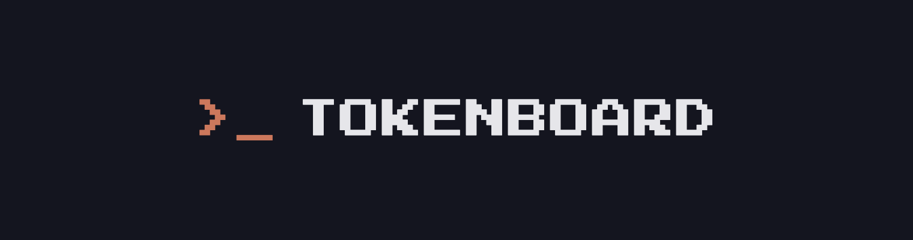

<div align="center">



### See who's burning the most tokens.

A public leaderboard for agentic-coding usage. tokenboard reads how many tokens
you burn across Claude Code, Codex, Opencode, etc.

<br />

</div>

---
## How it works

```bash
npx @tokenboard/cli     # see your number locally (no login)
                        # then claim your spot with GitHub
```

- A small CLI reads the usage logs your agentic tools already write **on your machine**
- It uploads **aggregate token counts only**, run `tokenboard show-data` to see the exact
  payload before anything is sent (after a global install the command is just `tokenboard`)
- The web dashboard ranks you within your communities, over rolling time windows
- Sync hourly in the background (or any time you run the CLI)

## Privacy

tokenboard uploads **only aggregate token counts** per (day, tool, model),  never
prompts, code, file paths, or repo names. The CLI is open source, installs via `npx`
(not `curl | bash`), and ships a `show-data` dry-run so you can verify exactly what
leaves your machine.
